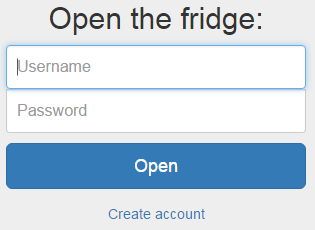
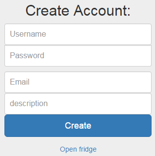

# Writeup for fridginator

> Solves: 52
> 
> Fridginator 10k - Web/Crypto - 200 pts - realized by clZ
  My brother John just bought this high-tech fridge which is all flashy and stuff, but has also added some kind of security mechanism which means I can't steal his food anymore... I'm not sure I can survive much longer without his amazing yoghurts. Can you find a way to steal them for me?
  [The fridge is here](http://fridge.insomnihack.ch/)

### ENG

### PL
Strona zawierała dwa formularze, jeden do rejestracji, drugi do logowania:

Po utworzeniu konta i zalogowaniu, pokazywał się następujący widok:

Przy próbie wyszukania jogurtu Johna i wzięcia go z lodówki, niestety dostawaliśmy informację, że nie jesteśmy uprawnieni do zabrania jego rzeczy.

Każda próba wyszukiwania przenosiła nas na url, przykładowo taki:
`http://fridge.insomnihack.ch/search/67d4b8f78c33d07cbdc7293b9cd93b8f37231e5001982893f5c3a6494d14bbba/`

Stwierdziliśmy, że to czego wyszukujemy jest kodowane, następnie przeniesieni zostajemy na podstronę z wygenerowanym w url zakodowanym zapytaniem. Musi tam więc nastąpić dekodowanie hasha z url, a następnie wyszukiwanie na podstawie zdekodowanych wartości.

Po kilku próbach wysyłania zapytań, ustaliliśmy, że na jeden 32 znakowy hash, składa się maksymalnie 16 znaków. A także, że kodowanie wygląda następująco.
[przedrostek][nasze zapytanie][przyrostek]. Ustaliliśmy również, że [przedrostek] składa się z 7 znaków. A [przyrostek], zależnie od tego czy wyszukujemy użytkowników, czy produktów, z 11 lub 13 znaków. [przedrostek] wyglądał nam od razu na wartość `search=` sprawdziliśmy i zgadzało się. [przyrostek] musiał posiadać informację w jakiej tabeli następuje wyszukiwanie. Napisalismy mały półautomatyczny skrypt [brute.py](brute.py), który pomógł nam litera po literze poznać wartość przyrostka, dla produktów wyglądał następująco `|type=object%01` (%01 to oczywiście 1 znak Start of Heading po zdekodowaniu).

Pozostało nam więc zapełnić 1. blok znaków do 16 liter, czyli pamiętając, że 7 znaków pochłonie `search=` przesłać 9 dowolnych znaków. Następnie przesłać nasz kod, który chcemy wykonać, który musiał mieć długość równą wielokrotności liczby 16, aby nie pomieszać się z przyrostkiem. Wygenerowany hash miał więc pierwszy blok który nas kompletnie nie interesował i ostatni blok, który również nas nie interesował. Skopiować należało hashe ze środkowych bloków i podstawić pod url `http://fridge.insomnihack.ch/search/...`

Próbując różnych zapytań ustaliliśmy, że zapytanie do bazy wygląda następująco: `SELECT * FROM objsearch_X WHERE description LIKE ?` X było wartością z `type=`, która nie była filtrowana i mogliśmy tam wstrzyknąć nasze zapytanie.

Stworzyliśmy więc zapytanie, które dzięki podatności na sqlinjection zwracało nam hasło Johna: `aaaaaaaaasearch=%%%%%%%%%%%%%%|type=object union select '5' as description, '1', (SELECT password FROM objsearch_user WHERE username ="John"), '3', '4' %01`

zwrócony hash wyglądał następująco: 

`5616962f8384b4f8850d8cd1c0adce98428072146d4f6e8cab3f5da04aecd14f4cd1be3e4e45844001c98397c8907136d85f1f4a5b5cf842c6a77e3eb42ad1b1d213bf36bb7a28f0a4162cdbbaf2384c58ffeeeefa2f0d7a37dea5ddbc39f008028cb773e1d9f162d3ab47c414cf441834ee8034b0799f5513e4bcaa777c29bbde35ba503c28f25be7860e4e6478924c8749a3e9bbbdd48c39aa45a0cd6c90a1d9cc5ea47c14d6fb630320a5dfa0bbca`

wycięliśmy pierwszy i ostatni blok, które wszystko psują swoim przed i przyrostkami, więc wynikowo hash wyglądał tak:

`428072146d4f6e8cab3f5da04aecd14f4cd1be3e4e45844001c98397c8907136d85f1f4a5b5cf842c6a77e3eb42ad1b1d213bf36bb7a28f0a4162cdbbaf2384c58ffeeeefa2f0d7a37dea5ddbc39f008028cb773e1d9f162d3ab47c414cf441834ee8034b0799f5513e4bcaa777c29bbde35ba503c28f25be7860e4e6478924c8749a3e9bbbdd48c39aa45a0cd6c90a1`

A zapytanie do bazy wyglądało rzeczywiście tak:

`SELECT * FROM objsearch_object UNION SELECT '1' AS description, '2', (SELECT password FROM objsearch_user WHERE username ="John"), '4', '5' WHERE description LIKE %%%%%%%%%%%%%%`

Dostaliśmy dzięki temu wynik zawierający wszystkie produkty, a także jeden dodatkowy wpis zawierający hasło Johna w plaintext.

Następnie zalogowaliśmy się na konto Johna, wzięliśmy z lodówki jogurt i dostaliśmy flagę.