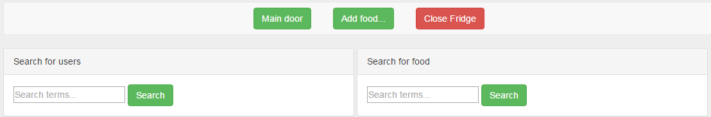
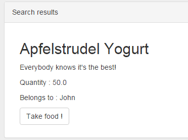

# Writeup for fridginator

> Solves: 52
> 
> Fridginator 10k - Web/Crypto - 200 pts - realized by clZ
  My brother John just bought this high-tech fridge which is all flashy and stuff, but has also added some kind of security mechanism which means I can't steal his food anymore... I'm not sure I can survive much longer without his amazing yoghurts. Can you find a way to steal them for me?
  [The fridge is here](http://fridge.insomnihack.ch/)

### ENG

When we visit the site for the first time, login form with link to a register site can be seen.
After creating an account and logging into it, one can see:

When we try to search `Johns Yoghurt` and take it from the fridge, we got the info, that we are not allowed.

Any attempt to search (either for user or object) takes us on a URL of following format:
`http://fridge.insomnihack.ch/search/ many_hex_digits /`
for example:
`http://fridge.insomnihack.ch/search/67d4b8f78c33d07cbdc7293b9cd93b8f37231e5001982893f5c3a6494d14bbba/`

We figured out, that the query must be encoded to these many_hex_digits, because:

* The consecutive searches for the same string give the same encoded text, so it is not a hash of *search results*.

* The longer the search term is, the longer the `many_hex_digits` section is.

After several attempts to send queries, we agreed that one 32 length hash block consists of a maximum 16 chars. Coding looks as follows: `[prefix][our query][suffix]`. `[prefix]` has 7 chars. `[suffix]`, depending on whether we search users or products, has 11 or 13 chars. At first sight `[prefix]` seemed like `search=`, so we checked it. Good guess! 

The next thing - `[suffix]` must have information about the table we search in. We wrote a small semi-auto python script [brute.py](brute.py), which helped us to know suffix letter by letter.

For products suffix looked as `|type=object%01` (`%01` in hex ascii is in fact single char, representing `Start of Heading` character).

Next, we fill the 1. block to 16 chars, remembering that `search=` consume 7 chars- so we must add 9 random (any) chars. After that we must send our query, which must have increments of 16 chars, so it doesn't mix with suffix block. 
Then we have to get rid of first and last block of hash, which are completely not interesting. We need to copy only middle blocks, and paste them in the url `http://fridge.insomnihack.ch/search/ HERE /`.

Trying various queries, we agreed that the real database query looks like: `SELECT * FROM objsearch_X WHERE description LIKE ?` X was a value from `type=`, which has not been filtered and could have injected our prepared query.

We created a query, which returns password of John, thanks to the fact that query have sql injection vulnerability. `aaaaaaaaasearch=%%%%%%%%%%%%%%|type=object union select '5' as description, '1', (SELECT password FROM objsearch_user WHERE username ="John"), '3', '4' %01`

Returned hash looked like:
`5616962f8384b4f8850d8cd1c0adce98428072146d4f6e8cab3f5da04aecd14f4cd1be3e4e45844001c98397c8907136d85f1f4a5b5cf842c6a77e3eb42ad1b1d213bf36bb7a28f0a4162cdbbaf2384c58ffeeeefa2f0d7a37dea5ddbc39f008028cb773e1d9f162d3ab47c414cf441834ee8034b0799f5513e4bcaa777c29bbde35ba503c28f25be7860e4e6478924c8749a3e9bbbdd48c39aa45a0cd6c90a1d9cc5ea47c14d6fb630320a5dfa0bbca`

We removed first and last block (remember- 32 chars per block), which contain unnecessary prefix and suffix, and finally we got the following hash:

`428072146d4f6e8cab3f5da04aecd14f4cd1be3e4e45844001c98397c8907136d85f1f4a5b5cf842c6a77e3eb42ad1b1d213bf36bb7a28f0a4162cdbbaf2384c58ffeeeefa2f0d7a37dea5ddbc39f008028cb773e1d9f162d3ab47c414cf441834ee8034b0799f5513e4bcaa777c29bbde35ba503c28f25be7860e4e6478924c8749a3e9bbbdd48c39aa45a0cd6c90a1`

And real sql query looked like:

`SELECT * FROM objsearch_object UNION SELECT '1' AS description, '2', (SELECT password FROM objsearch_user WHERE username ="John"), '4', '5' WHERE description LIKE %%%%%%%%%%%%%%`

We got a search result, which contained all products (`SELECT * FROM objsearch_object`), plus one extra- the John's password  in plaintext (`SELECT '1' AS description, '2', (SELECT password FROM objsearch_user WHERE username ="John"), '4', '5' WHERE description LIKE %%%%%%%%%%%%%%`).

Finally, we logged into the account of John, took his yoghurt from the fridge, and got the flag.

### PL
Strona przy powitaniu zawierała dwa formularze, jeden do rejestracji, drugi do logowania.

Po utworzeniu konta i zalogowaniu, pokazywał się następujący widok:

Przy próbie wyszukania jogurtu Johna i wzięcia go z lodówki, niestety dostawaliśmy informację, że nie jesteśmy uprawnieni do zabrania jego rzeczy.

Każda próba wyszukiwania przenosiła nas na url, przykładowo taki:
`http://fridge.insomnihack.ch/search/67d4b8f78c33d07cbdc7293b9cd93b8f37231e5001982893f5c3a6494d14bbba/`

Stwierdziliśmy, że to czego wyszukujemy jest kodowane, następnie przeniesieni zostajemy na podstronę z wygenerowanym i zakodowanym w url zapytaniem. Musi tam więc nastąpić dekodowanie hasha z url, a następnie wyszukiwanie na podstawie zdekodowanych wartości.

Po kilku próbach wysyłania zapytań, ustaliliśmy, że na jeden 32 znakowy blok hasha, składa się maksymalnie 16 znaków. A także, że kodowanie wygląda następująco.
[przedrostek][nasze zapytanie][przyrostek]. Ustaliliśmy również, że [przedrostek] składa się z 7 znaków. A [przyrostek], zależnie od tego czy wyszukujemy użytkowników, czy produktów, z 11 lub 13 znaków. [przedrostek] wyglądał nam od razu na wartość `search=` sprawdziliśmy i zgadzało się. [przyrostek] musiał posiadać informację w jakiej tabeli następuje wyszukiwanie. Napisalismy mały półautomatyczny skrypt [brute.py](brute.py), który pomógł nam litera po literze poznać wartość przyrostka, dla produktów wyglądał następująco `|type=object%01` (%01 to oczywiście 1 znak Start of Heading po zdekodowaniu).

Pozostało nam więc zapełnić 1. blok znaków do 16 liter, czyli pamiętając, że 7 znaków pochłonie `search=` przesłać 9 dowolnych znaków. Następnie przesłać nasz kod, który chcemy wykonać, który musiał mieć długość równą wielokrotności liczby 16, aby nie pomieszać się z blokiem przyrostka. Wygenerowany hash miał więc pierwszy blok który nas kompletnie nie interesował i ostatni blok, który również nas nie interesował. Skopiować należało hashe ze środkowych bloków i podstawić pod url `http://fridge.insomnihack.ch/search/...`

Próbując różnych zapytań ustaliliśmy, że zapytanie do bazy wygląda następująco: `SELECT * FROM objsearch_X WHERE description LIKE ?` X było wartością z `type=`, która nie była filtrowana i mogliśmy tam wstrzyknąć nasze spreparowane zapytanie.

Stworzyliśmy więc zapytanie, które dzięki podatności na sqlinjection zwracało nam hasło Johna: `aaaaaaaaasearch=%%%%%%%%%%%%%%|type=object union select '5' as description, '1', (SELECT password FROM objsearch_user WHERE username ="John"), '3', '4' %01`

zwrócony hash wyglądał następująco: 

`5616962f8384b4f8850d8cd1c0adce98428072146d4f6e8cab3f5da04aecd14f4cd1be3e4e45844001c98397c8907136d85f1f4a5b5cf842c6a77e3eb42ad1b1d213bf36bb7a28f0a4162cdbbaf2384c58ffeeeefa2f0d7a37dea5ddbc39f008028cb773e1d9f162d3ab47c414cf441834ee8034b0799f5513e4bcaa777c29bbde35ba503c28f25be7860e4e6478924c8749a3e9bbbdd48c39aa45a0cd6c90a1d9cc5ea47c14d6fb630320a5dfa0bbca`

wycięliśmy pierwszy i ostatni blok, które wszystko psują swoim przed i przyrostkami, więc wynikowo hash wyglądał tak:

`428072146d4f6e8cab3f5da04aecd14f4cd1be3e4e45844001c98397c8907136d85f1f4a5b5cf842c6a77e3eb42ad1b1d213bf36bb7a28f0a4162cdbbaf2384c58ffeeeefa2f0d7a37dea5ddbc39f008028cb773e1d9f162d3ab47c414cf441834ee8034b0799f5513e4bcaa777c29bbde35ba503c28f25be7860e4e6478924c8749a3e9bbbdd48c39aa45a0cd6c90a1`

A zapytanie do bazy wyglądało rzeczywiście tak:

`SELECT * FROM objsearch_object UNION SELECT '1' AS description, '2', (SELECT password FROM objsearch_user WHERE username ="John"), '4', '5' WHERE description LIKE %%%%%%%%%%%%%%`

Dostaliśmy dzięki temu wynik zawierający wszystkie produkty (`SELECT * FROM objsearch_object`), a także jeden dodatkowy wpis zawierający hasło Johna w plaintext (`SELECT '1' AS description, '2', (SELECT password FROM objsearch_user WHERE username ="John"), '4', '5' WHERE description LIKE %%%%%%%%%%%%%%`).

Następnie zalogowaliśmy się na konto Johna, wzięliśmy z lodówki jogurt i dostaliśmy flagę.