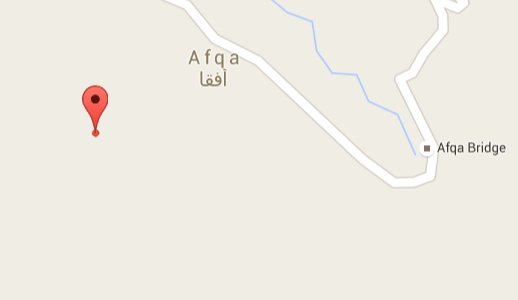

# Interpolation (Reverse, 400)

> NEWTON is an autonomous unmanned aerial vehicle (UAV). Where the UAV is refueled at t=180 ?

> Path planning:
> t x y
> 0; 35.645592; 50.951123;
> 20; 35.144068; 50.467725;
> 40; 34.729775; 48.204541;
> 60; 34.204433; 46.117139;
> 80; 33.602623; 44.908643;
> 100; 33.162285; 42.337842;
> 120; 33.712359; 40.140576;
> 140; 33.931410; 38.580518;
> 150; 33.894940; 37.745557;
> 170; 33.474422; 36.273389;
> 190; 35.32583531; 35.663648;
> 210; 33.130089; 35.19047214;
> 220; 32.409544; 35.141797;
> 230; 32.085525; 34.786115;

> The flag is: [the bridge`s name near the refule place]_[Latitude of the place with 5 digits after the decimal point]_[Longitude of the place with 5 digits after the decimal point] 

The name of the task was more than enough hint

To find coordinates in t=180 we used simple script:

```python
x = [0,20,40,60,80,100,120,140,150,170,190,210,220,230]
y = [35.645592,35.144068,34.729775,34.204433,33.602623,33.162285,33.712359,
    33.931410,33.894940,33.474422,35.32583531,33.130089,32.409544,32.085525]
y1 = [50.951123,50.467725,48.204541,46.117139,44.908643,42.337842,40.140576,
    38.580518,37.745557,36.273389,35.663648,35.19047214,35.141797,34.786115]
n = len(x)
a = 180

def interpol (x ,y, n, a):
    coordinates = 0
    for i in range(0,n):
        c = z = 1.0
        for j in range(0,n):
            if j!=i:
                c=c*(a-x[j])
                z=z*(x[i]-x[j])
        coordinates = coordinates+((c/z)*y[i])
    return coordinates

latitude = str(interpol(x,y,n, a))[:8]
longitude = str(interpol(x,y1,n,a))[:8]

print "%s_%s" % (latitude,longitude)
```

Google maps showed us a place, close to this place we found: Afqa Bridge



When we combined the name of the bridge and coordinates together according to guidelineswe got flag:

    Afqa_34.06829_35.88253
