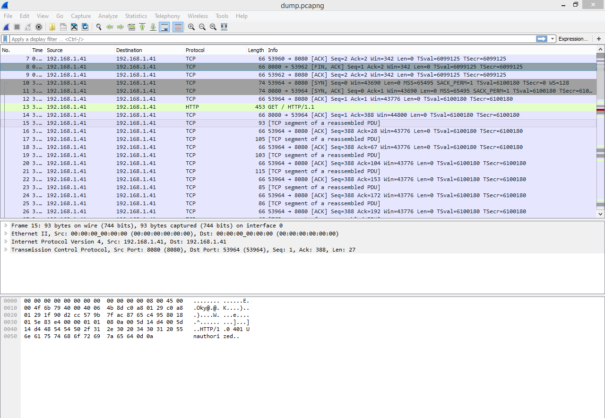
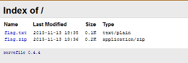
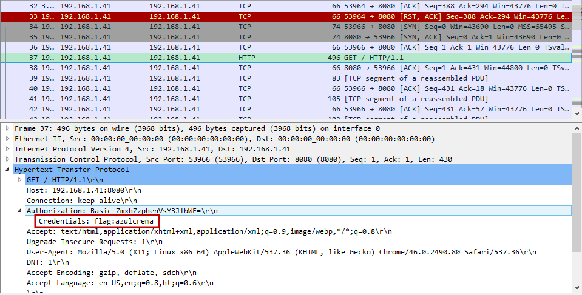

# Rock with the wired shark! (Misc, 70p)

```Sniffing traffic is fun. I saw a wired shark. Isn't that strange?```

As entry for this task we have **[pcapng](./dump.pcapng.gz)** file, and some poetry about wired shark... 

After standard checking, seems in fact its Wireshark file. Lets dig into.



And what's there? Some TCP traffic and few http GET's. So lets try what we can extract. We got:
* flag.zip (nice)
* html with error (not important)
* html from screen below, so we can see someone was getting flag.zip from that page 


From those flag.zip looks most interesting. Its in fact zip archive containing flag.txt. Yay. But its also password protected. Buu.

_At this point I've lead myself astray (thinking task is harder, than it happened to be - judging by amount of points, not knowing those are at random:)._

_I was thinkig about bruteforcing this zip, but to do it in reasonable time, its good to have something more than archive itself. So I started to investigate code from here: http://seba-geek.de/stuff/servefile/ as it was in html file._

_Bang! Dead End._

Lets go back to Wireshark. I've tried few tricks - without success off course. Than thought: lets look once more for get requsts, maybe there is something interesting?


Yup. "azulcrema". Now all what has left was to extract archive and enter flag.

**IW{HTTP_BASIC_AUTH_IS_EASY}**

