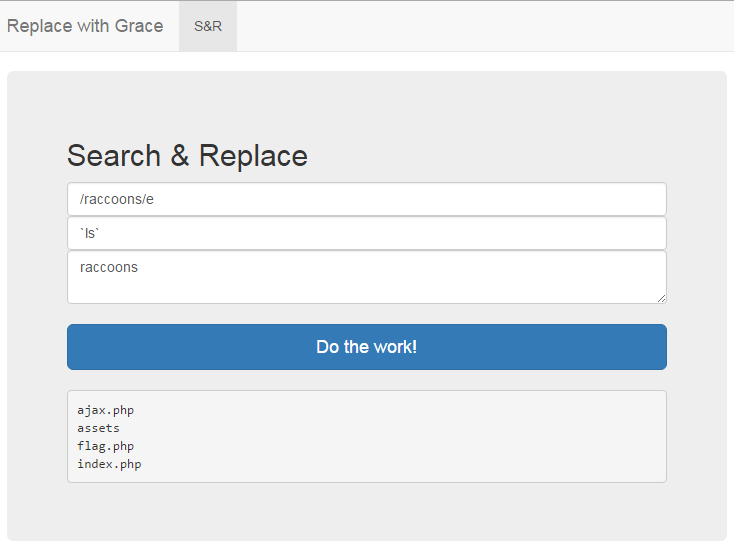
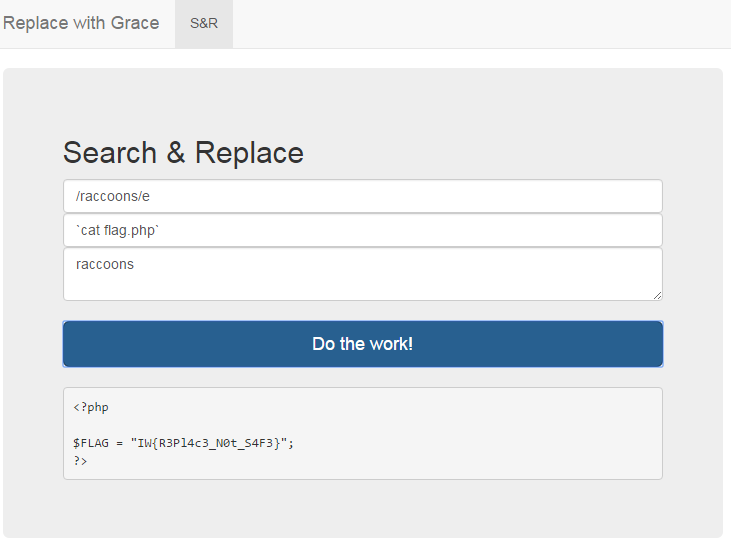

# Writeup for Replace with Grace (WEB60) (60)

> Solves: 248
> Description: Regular expressions are pretty useful. Especially when you need to search and replace complex terms.
> Service: https://replace-with-grace.ctf.internetwache.org/
  
The website contain form with 3 inputs

looked like sending the parameters to the php [`preg_replace`](http://php.net/manual/en/function.preg-replace.php) function. Pattern (first input) may contain [PCRE modifiers](http://php.net/manual/en/reference.pcre.pattern.modifiers.php). So if we added `e` modifier, by manual:
> If this deprecated modifier is set, preg_replace() does normal substitution of backreferences in the replacement string, evaluates it as PHP code, and uses the result for replacing the search string. Single quotes, double quotes, backslashes (\\) and NULL chars will be escaped by backslashes in substituted backreferences

we could execute own code in second input. 

First we did `ls`. We used backticks, because other commands like `exec` were blacklisted.
 

and after that, put `cat flag.php`

and finally we got the flag