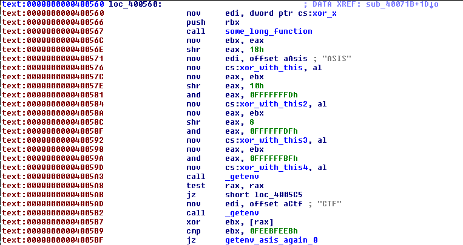
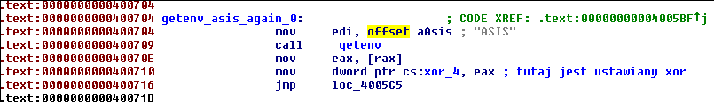
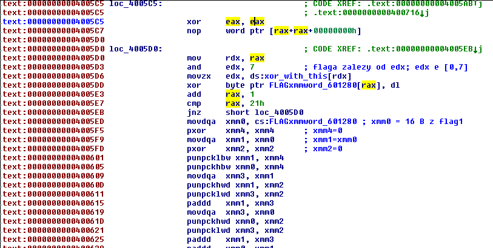
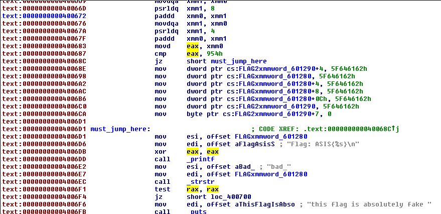

Catch Me!
========

* **CTF:** [ASIS CTF Quals 2016](https://asis-ctf.ir/)
* **Category:** Reverse
* **Points:** 87
* **Solves:** 51

> Catch me if you can!

You can download original binary below

[Catch_Me](Catch_Me)

In my opinion this task was hard but not because it was hard to reverse it but this task contains one funckup  

this is x86_64 binary for linux

```
b@eye:~/Desktop > ./Catch_Me
Flag: ASIS{bad_bad_bad_bad_bad_bad}
this flag is absolutely fake
```

I started from analysis this binary in Ida Pro. There was not much assembly so weren't hard to find interesting places. Below I present assembly snippets with analysis:  



firstly is called a big function which is quite complicated, I din't analyse this function. 4B of some operations on output of this functions are saved into a buffer 'xor_with_this'
next it's checked if environment variable "ASIS" is defined, next 4B of environment variable "CTF" are xored with some value in ebx
and the result of operation have to be equal 0FEEBFEEBh

it's not most challenging part of this task so I'm only saying that this command does the trick

```
export CTF=`python -c'print "\x0a\xda\xf2\x4f"'`
```



4B of environment variable 'ASIS' are placed to (the same buffer as before) + 4  




encrypted flag (32B) is xored with 8B of buffer 'xor_with_this'

next takes place some complicated operations only on data in 'xor_with_this', if result of these computation is equal to 954h, printed is real flag


I set a breakpoint on .text:00000000004005D6                 movzx   edx, ds:xor_with_this[rdx] and printed data in buffer xor_with_this ( I made export ASIS=aaaa before)

```
gdb-peda$ x/8b 0x6012a8
0x6012a8:       0xb1    0x19    0x04    0xa1    0x61    0x61    0x61    0x61
```

ok, I know 4 bytes should be 0xb1    0x19    0x04    0xa1

next 4 bytes I can brute force by setting value to environment variable 'ASIS' and running this binary again and again will be too slow

I just copied this asm code, pasted to "__asm__()" in C and modified following things:  
-changed jmp [adress] to jmp [label_name]  
-zeroed on the beginning rax and rdx just in case  
-removed useless code (printing that flag is bad)  
-when eax = 0x954, I'm calling a function which will print the flag  
-modified variables addresses in following way:  
I created global variables (and function printing the flag) in my C code, and created whole program, which prints addresses of these variables (and function printing the flag)  
when I firstly started this program it printed addresses of my variables and it crashed  
then I pasted addresses of my variables to assembly code and my program was working. probably you will have to change these values  

here is my function after these modyfications:  

```C
int check(void)
{ 
  /*
   xor=0x601060
   flag1=0x6010a0
   flag2=0x6010b0
   func_flag_ok=0x4005ed
*/

  __asm__(
        "xor %rax, %rax\n\t" //$rax=0
	"xor %rdx, %rdx\n\t" //$rax=0
	"beginning:\n\t"
        "mov %rax,%rdx\n\t" //$rdx=$rax
        "and $0x7,%edx\n\t" 
        "movzbl 0x601060(%rdx),%edx\n\t" //xor_with_this
        "xor %dl,0x6010a0(%rax)\n\t"    //flag1
        "add $0x1,%rax\n\t"
        "cmp $0x21,%rax\n\t"
        "jne beginning\n\t"
        "movdqa 0x6010a0,%xmm0\n\t" //flag1 //"movdqa 0x200c8b(%rip),%xmm0 # 0x601280\n\t"
        "pxor %xmm4,%xmm4\n\t"
        "movdqa %xmm0,%xmm1\n\t"
        "pxor %xmm2,%xmm2\n\t"
        "punpcklbw %xmm4,%xmm1\n\t"
        "punpckhbw %xmm4,%xmm0\n\t"
        "movdqa %xmm1,%xmm3\n\t"
        "punpckhwd %xmm2,%xmm1\n\t"
        "punpcklwd %xmm2,%xmm3\n\t"
        "paddd %xmm3,%xmm1\n\t"
        "movdqa %xmm0,%xmm3\n\t"
        "punpckhwd %xmm2,%xmm0\n\t"
        "punpcklwd %xmm2,%xmm3\n\t"
        "paddd %xmm3,%xmm1\n\t"
        "paddd %xmm1,%xmm0\n\t"
        "movdqa 0x6010b0,%xmm1\n\t" //flag2 //"movdqa 0x200c5b(%rip),%xmm1 # 0x601290\n\t"
        "movdqa %xmm1,%xmm3\n\t"
        "punpckhbw %xmm4,%xmm1\n\t"
        "punpcklbw %xmm4,%xmm3\n\t"
        "movdqa %xmm3,%xmm4\n\t"
        "punpckhwd %xmm2,%xmm3\n\t"
        "punpcklwd %xmm2,%xmm4\n\t"
        "paddd %xmm4,%xmm0\n\t"
        "paddd %xmm3,%xmm0\n\t"
        "movdqa %xmm1,%xmm3\n\t"
        "punpckhwd %xmm2,%xmm1\n\t"
        "punpcklwd %xmm2,%xmm3\n\t"
        "paddd %xmm3,%xmm0\n\t"
        "paddd %xmm1,%xmm0\n\t"
        "movdqa %xmm0,%xmm1\n\t"
        "psrldq $0x8,%xmm1\n\t"
        "paddd %xmm1,%xmm0\n\t"
        "movdqa %xmm0,%xmm1\n\t"
        "psrldq $0x4,%xmm1\n\t"
        "paddd %xmm1,%xmm0\n\t"
        "movd %xmm0,%eax\n\t"
        "cmp $0x954,%eax\n\t"
        "je must_jump_here\n\t"
        "jmp bad_flag\n\t"
	"must_jump_here:\n\t"
        "callq 0x4005ed\n\t" //func_flag_ok
	"bad_flag:\n\t"
	"xor %rax, %rax"
   );
}
```

[here](cracker1.c) is my whole brute-forcer, note that the number of potential flags is:  

```
b@eye:~/Desktop > ./cracker | wc -l
1623866
```

I was thinking that something is bad in my code and I spent much time of thinking what's wrong  

and next I will be talking about fuckup in this task I mentioned before  

I've noticed that somewhere in the code is called ptrace  
it's anti-reversing technique [link](https://xorl.wordpress.com/2009/01/01/quick-anti-debugging-trick-for-gdb/)  

and 4 first bytes in buffer 'xor_with_this' changes when ptrace will return 0 (no-debugger)  
I discovered that the result of function ptrace is next passed to some_long_function  
I patched binary to act like without debugger present all the time and updated first 4 bytes in my buffer 'xor_with_this' in cracker.c  
but again, I wasn't getting reasonable results, I wasn't getting any results as I remember  

[here I spend a lot time thinking what is wrong]  

I discovered that when I withdraw my patch in binary, these first 4bytes makes 50% of flag ascii-readable, 4B from patched binary newer will be ascii-readable (it's only xor so it'not hard to conclude this)  

I coded [script](cracker.py) in python which will print set of bytes in every position which will make flag printable  

I modified my previos cracker to crack only bytes which are printed by my script in given position  

[here](cracker2.c)  

```
b@eye:~/Desktop > ./cracker | wc -l
188
```

much better!  

most legit string was ASIS{600d_j0b_y0u_4r3_63771n6_574r73d} and it was the flag  

yep, sorry for quality of my code :D but although it works  